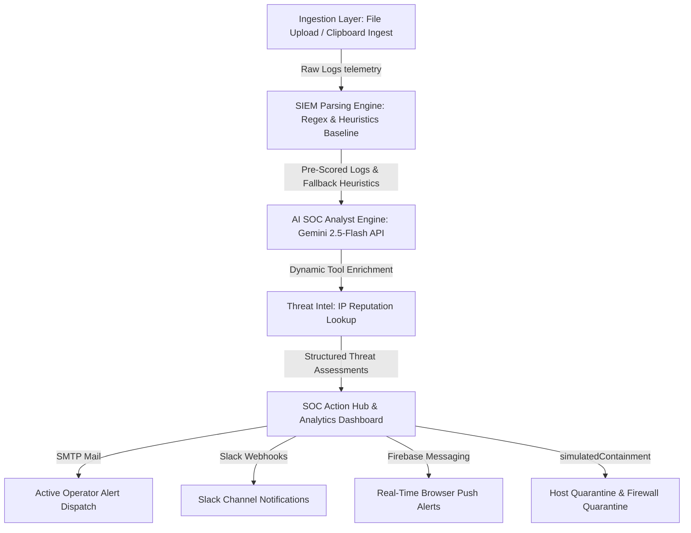

# 🛡️ SENTIAL AI — Autonomous SOC Threat Analyzer & Incident Dispatcher

SENTIAL AI is an enterprise-grade, autonomous Security Operations Center (SOC) threat monitor and incident containment dashboard. It ingests raw server telemetry, correlates attack vectors using standard parsing heuristics, leverages the advanced intelligence of Google Gemini for high-fidelity structured threat assessments, and dispatches real-time multi-channel alerts (Slack Webhooks, SMTP Email, and Firebase Cloud Messaging) to human response units.

---

## 📐 System Pipeline Architecture

Below is the end-to-end data flow pipeline of SENTIAL AI:



---

## 🌟 Core System Capabilities

### 1. 🔒 Secure Authentication & Redirection Gate
Guarded by a custom React `ProtectedRoute` structure linked with a persistent client-side session context (`AuthContext` backed by `localStorage`). Includes an interactive operator gate featuring sliding login/signup transitions, animated security handshake validation sequences, password visibility selectors, and a **"Quick Load Demo"** button to allow instant evaluation by judges without typing.

### 2. 📊 High-Fidelity Recharts Dashboards
The Analytics console visualizes active telemetry dynamically:
* **Interactive Pie Chart**: Renders structured vulnerability vector allocations (e.g. SQL Injection vs. XSS) complete with automatic legends.
* **Incident Severity Vector Matrix**: A robust **Bar Chart** reflecting event counts categorized by security priority level (Critical, High, Medium, Low, Benign/FP).

### 3. ⚙️ Slack-Style Enterprise Workspace Settings
An interactive administration console specifically customized for SENTIAL AI:
* **Workspace Settings**: Toggle default landing channels, approved domains, language preferences, and custom naming regulations.
* **clearance ACLs**: Live invite-prompt teammate additions and removal tools.
* **API key Triage**: Dynamically generate new integration keys (`sk_live_...`) or revoke tokens instantly.
* **Danger Zone**: A secure, typing-validated Workspace Deletion modal requiring the operator to type `"SENTIAL AI"` to initiate the system wipe script.

### 4. 🚨 Multi-Channel Alerting Channels
* **Slack Channels**: Real-time webhook dispatches containing IP details, severity, and raw payloads.
* **Operator SMTP Email Alerts**: Automatically matches the active investigator's profile email to route high-severity warnings directly to their inbox alongside default security teams.
* **Firebase Messaging (FCM)**: Uses the Python Firebase Admin SDK to broadcast background/foreground push notifications to active browser clients.

---

## 🛠️ Setup & Installation (Windows)

Follow these steps to deploy and compile SENTIAL AI locally:

### 1. Python Backend Deployment
Configure a clean virtual environment and install the required dependencies:
```powershell
# Navigate to workspace
cd d:\id1\security-agent-soc

# Setup virtual environment
python -m venv venv
venv\Scripts\activate

# Install requirements
pip install -r requirements.txt
```

### 2. Configure Environment `.env`
Ensure your root-level `.env` holds the correct keys (secured via `.gitignore`):
```env
GEMINI_API_KEY="YOUR_GEMINI_API_KEY"
SLACK_WEBHOOK_URL="YOUR_SLACK_WEBHOOK_URL"
# Optional SMTP Settings for real email alerts
SMTP_HOST=smtp.gmail.com
SMTP_PORT=587
SMTP_USER=your_email@gmail.com
SMTP_PASS=your_app_password
ALERT_FROM=alerts@sential.ai
ALERT_TO=secops@sential.ai
```

### 3. Frontend Client Compilation
Build and bundle the Vite SPA assets:
```powershell
cd frontend
npm install
npm run build:client
npm run build:server
```

### 4. Start the Application
Execute the local HTTP server:
```powershell
# In the root workspace
venv\Scripts\python server.py
```
Open your browser and navigate to **[http://localhost:8000](http://localhost:8000)**.

---

## 📝 SOC Log Ingestion Guide

SENTIAL AI is built to ingest and triage standard raw text logs from typical server architectures. Below is a handbook detailing how to acquire, format, and copy these logs from real production servers.

### 🌐 1. Web Server Access Logs (Nginx / Apache)
* **What they show**: Web traffic details, resource accesses, HTTP status codes, and user-agent strings. Used to detect **SQL Injection**, **XSS script tags**, or **directory traversals**.
* **Log Location**: `/var/log/nginx/access.log` or `/var/log/apache2/access.log`.
* **Export Command**:
  ```bash
  # Grab the last 100 HTTP requests targeting port 80/443
  tail -n 100 /var/log/nginx/access.log | grep -E "UNION|SELECT|script|etc/passwd"
  ```
* **Sample log structure**:
  ```log
  2026-05-24T14:05:12 IP=45.12.88.192 PORT=80 USER=guest ACTION=union_select_sql_injection
  ```

### 🔑 2. SSH / Authentication Audit Logs (`auth.log`)
* **What they show**: System logins, authorization events, sudo elevations, and SSH key matches. Used to identify **brute force authentication**, **credential stuffing**, or **unauthorized host connections**.
* **Log Location**: `/var/log/auth.log` (Ubuntu/Debian) or `/var/log/secure` (RHEL/CentOS).
* **Export Command**:
  ```bash
  # Filter out failed password logins to catch brute-force intruders
  grep "Failed password for" /var/log/auth.log | tail -n 50
  ```
* **Sample log structure**:
  ```log
  2026-05-24T08:12:01 IP=198.51.100.42 PORT=4444 USER=admin ACTION=failed_login
  ```

### 💻 3. Windows Security Event Logs (RDP)
* **What they show**: Local and Remote Desktop logins. SOC analysts track **Event ID 4625** (failed account logon) and **Event ID 4624** (successful logon).
* **Log Location**: Windows Event Viewer (`Security.evtx`).
* **Export Command (PowerShell)**:
  ```powershell
  # Fetch the last 20 failed RDP authentication sequences
  Get-WinEvent -FilterHashtable @{LogName='Security';ID=4625} -MaxEvents 20 | Select-Object TimeCreated, Message
  ```
* **Sample log structure**:
  ```log
  2026-05-24T14:15:33 IP=203.0.113.111 PORT=3389 USER=unknown ACTION=failed_rdp_bruteforce
  ```

### ☁️ 4. Cloud Infrastructure Trails (AWS CloudTrail / GCP Audit)
* **What they show**: Internal API triggers, user actions on infrastructure, security group updates, or VPC configuration shifts.
* **Location**: AWS S3 Bucket or GCP Cloud Logging.
* **Export Command (AWS CLI)**:
  ```bash
  # Retrieve recent events from AWS CloudTrail
  aws cloudtrail lookup-events --max-items 10 --query "Events[*].CloudTrailEvent" --output text
  ```
